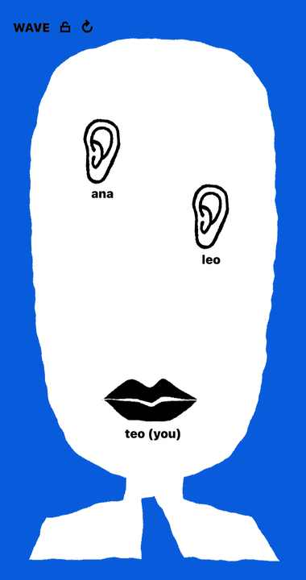

# Murmur

Push-to-talk voice chat. **[Try it](https://sryo.github.io/murmur/)**

## How it works

- Open the app and you get a room with a 4-character code. Tap the code to copy a link. Anyone with the link joins.
- No accounts and no server. Audio goes straight between browsers over WebRTC.
- Browsers find each other through public Nostr relays, using [Trystero](https://github.com/dmotz/trystero). The relays carry the handshake only, never audio.
- Hold your mouth to talk to the room. On desktop, hold Space.
- Hold someone's ear to whisper. Only they hear you. Everyone else gets silence.

Visual design inspired by [Kenneth Andersson](https://www.kennethandersson-studio.com/).
